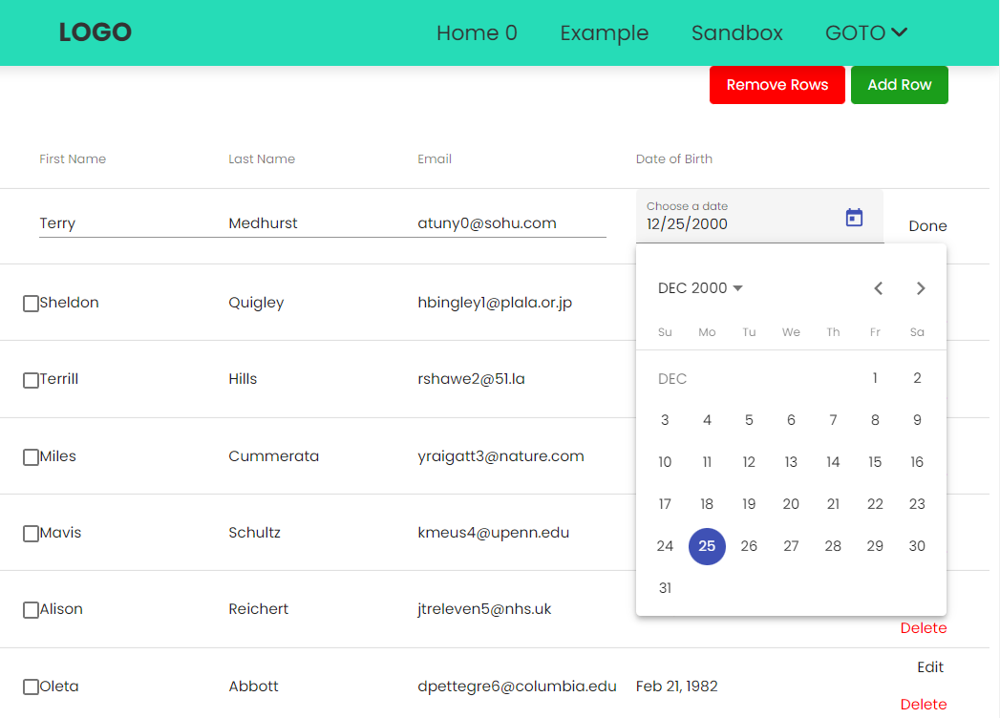
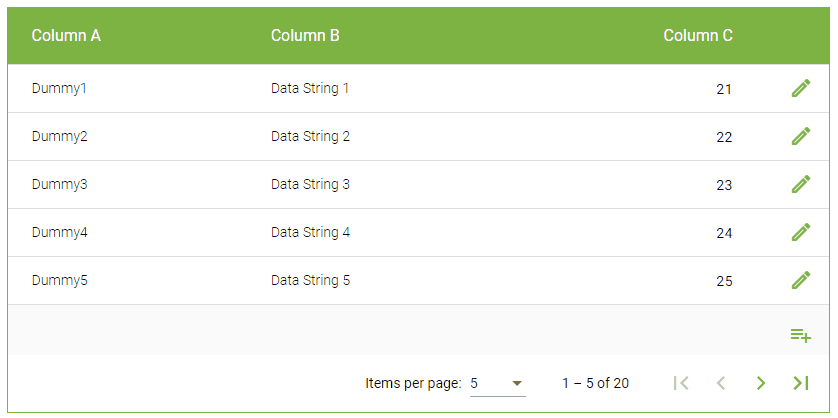

# AngularMaterialTableApp

## Setup Project

```

Step 1 – Create Angular App

# Install NG CLI
npm install -g @angular/cli

#Update NG CLI
ng update

ng new angular-material-table-app

cd angular-material-table-app

Install Material Library


Step 2 – Install Material Library

ng add @angular/material

# ? Choose a prebuilt theme name, or "custom" for a custom theme: Indigo/Pink
# ? Set up global Angular Material typography styles? No  
# ? Set up browser animations for Angular Material? Yes


Step 3 – Import Material Modules in AppModule

see app.module.ts

http://localhost:4200/

```

## Expanding the Project

ng g module inline-datepicker

ng g c inline-datepicker/inline-datepicker

ng g module core

ng g c core/components/home

ng g module example
ng g c components/example-home

ng g module sandbox

cd /c/sharing/github/angular-material-app/src/app/sandbox
ng g c components/sandbox-home
ng g module datatable
cd datatable   // /c/sharing/github/angular-material-app/src/app/sandbox/data-table
ng g c components/inline-datepicker
ng g c components/dialog-edit
ng generate component components/dialog-box


## Trouble Shooting

### Routing, cannot find page

```
    CoreModule,
    ExampleModule,
    SandboxModule,
    AppRoutingModule <---------------------- has to be AFTER all modules!!!

```

### error NG8002: Can't bind to 'icon' since it isn't a known property of 'fa-icon'.

font-awesome related errors:

> package.json

- not needed

```
npm i font-awesome --save
"font-awesome": "^4.7.0",
```

- one *ng add* is ok

```
ng add @fortawesome/angular-fontawesome@0.11.0

"@fortawesome/angular-fontawesome": "^0.11.0",
"@fortawesome/fontawesome-svg-core": "^6.1.1",
"@fortawesome/free-solid-svg-icons": "^6.1.2",
"@fortawesome/free-brands-svg-icons": "^6.1.2",
"@fortawesome/free-regular-svg-icons": "^6.1.2",
```

- old versions
- 
```
"@fortawesome/angular-fontawesome": "^0.9.0",
"@fortawesome/fontawesome-svg-core": "^1.2.36",
"@fortawesome/free-brands-svg-icons": "^5.15.4",
"@fortawesome/free-regular-svg-icons": "^5.15.4",
"@fortawesome/free-solid-svg-icons": "^5.15.4",
```

> FontAwesomeModule need to be imported in core.module.ts

### NG8002: Can't bind to 'ngModel' since it isn't a known property of 'input'

- Should import *FormsModule* on *app.module.ts* - *import { FormsModule } from "@angular/forms"*

### TS2307: Cannot find module '@fortawesome/free-solid-svg-icons' or its corresponding type declarations

npm i --save @fortawesome/free-solid-svg-icons

### Cannot find module '@angular/material-moment-adapter' or its corresponding type declarations.ts(2307)

Just run this CMD
```
npm i @angular/material-moment-adapter
```
If it shows any error install
```
npm i moment
```

### error TS7053: Element implicitly has an 'any' type because expression of type 'string' can't be used to index type

- if to disable globally

Go to the: tsconfig.json, and set the below options
```
"compilerOptions": {
        "noImplicitAny": false,
}
```

- Other solutions

Below are a few solutions to solve the "TS7053 Element implicitly has an 'any' type" error when accessing properties via array-access.

Original code:
```
const myObj: object = {}
const prop = 'propname'
myObj[prop] = 'string'  // Error!
```

Note: This does not work because the index-signature is still undefined:

```
const myObj: {propname: any} = {}
const prop = 'propname'
myObj[prop] = 'string'  // Error!
```

> Solution 1: Implicit define the index signature
```
const myObj: {[key: string]: any} = {}
const prop = 'propname'
myObj[prop] = 'string'
```
> Solution 2: Use an interface to provide the index signature
```
interface IStringIndex {
    [key: string]: any
}

const myObj: IStringIndex = {}
const prop = 'propname'
myObj[prop] = 'string'
```
> Solution 3: Use an interface and extend the <Record> utility type:
```
interface IStringIndex extends Record<string, any> {}

const myObj: IStringIndex = {}
const prop = 'propname'
myObj[prop] = 'string'
```
> Solution 4: Define a type alias with the index signature
```
type MyObject = {
    [key: string]: any
    propname?: any
}

const myObj: MyObject = {}
const prop = 'propname'
myObj[prop] = 'string'
```
> Solution 5: Combination of an interface to describe the index-signature and a type alias to describe valid properties:
```
interface IStringIndex extends Record<string, any> {}
type MyObject = IStringIndex & {
    propname?: string
}

const myObj: MyObject = {}
const prop = 'propname'
myObj[prop] = 'string'
```
> Solution 6: Define a list of valid (string) property names:
```
type ValidProps = 'propname' | 'value'
interface IStringIndex extends Record<ValidProps, any> {}

const myObj: IStringIndex = {
    propname: 'my prop',
    value: 123
}
const prop = 'propname'
myObj[prop] = 'string'
```

Note: All properties from the ValidProps list must be present when assigning the object!


## Refs:

### Angular Material Data Table

cd /c/sharing/github/angular-material-app/src/app/sandbox/data-table

> Create an Editable Dynamic Table using Angular Material

https://muhimasri.com/blogs/create-an-editable-dynamic-table-using-angular-material/  

https://muhimasri.com/blogs/add-and-remove-table-rows-using-angular-material/  

```
ng g c components/dyna-table
ng g c components/confirm-dialog
```




> Angular Material 13 Table Inline Datepicker Edit Mode Tutorial

https://www.freakyjolly.com/angular-material-table-inline-datepicker-edit-mode-tutorial/

ng g c components/inline-datepicker


> Angular 10|9|8 Edit/ Add/ Delete Rows in Material Table with using Dialogs inline Row Operation

https://www.freakyjolly.com/angular-material-table-operations-using-dialog/

```
ng g c components/dialog-edit  
ng g c components/dialog-box
```


> EdiTable — An editable table using Angular Material

https://owrrpon.medium.com/editable-an-editable-table-using-angular-material-7a4c4210bb71

ng g c components/edit-table



> Other

- https://stackoverflow.com/questions/56833469/typescript-error-ts7053-element-implicitly-has-an-any-type


